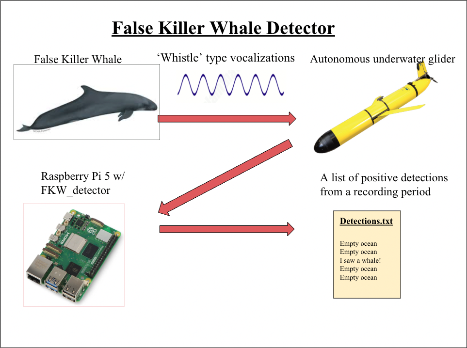

# FKW_detector
## Code written for underwater SeaGliders. 
This repository allows the glider to analyze a subset
of audio data from the previous ascent / descent. 
This repository is designed specifically to run on a 
Raspberry Pi 5. Newer versions of the Raspberry Pi may work,
but version below the 5 tend to be too slow. 

## Overview Diagram

## Intended Usage 
This repository is designed to run a Raspberry Pi 5 on a SeaGlider.
The main purpose of this code is to create a small summary of
the suspect presence of False Kilelr Whale wistles in the audio data.
However, this code can also be utilized to help create more training data
for itself. The Raspberry Pi 5 this code runs on is setup to run 
the FKW_detector code automatically at start time (instructions for
setting this up are provided in [/docs](docs)). It is up to the user
to tune mission parameters, such as the amount of data to analyze, in the 
[config.yaml](config.yaml) file.

## Performance Metrics 
The authors of this code have measured the performance metrics in laboratory
setting using an ~analog~ power supply and the "time" command in Linux. The following performance metrics were recorded:
- Average time to analyze 10 minutes of audio data: 
  - Real time:      3 minutes   6 seconds
  - User time:      1 minute    34 seconds
  - System time:    0 minutes   8 seconds

- Average voltage and current draw during analysis:
  - Voltage:        5.2 Volts
  - Current:        1.2 Amps

- Energy and time to analyze 60 minutes of audio data:
    - Energy:         1.06 Watt-Hours
    - Time:           10 minutes 12 seconds (real time)

- Suggested duty cycle: 
    - Analyze 1 hour of audio per each two to three hour ascend / descent cycle.

## Documentation
Further documentation, including instructions for setting up the Raspberry Pi 5,
running the repository manually, interpretting results, reading logs, and more can 
be found in the [/docs](docs) folder.